# Conecta Lactare — App Android (MVP)

> Cada gota importa. Cada conexão salva vidas.

MVP navegável do aplicativo Android **Conecta Lactare**, desenvolvido em **Kotlin + Jetpack Compose**
com dados mockados (sem integração com API, Firebase ou banco de dados local nesta sprint),
representando o comportamento principal da solução apresentada no pitch do Challenge Europharma 2026.

## Equipe Syncare · FIAP · Challenge Europharma 2026

| Nome completo | RM               |
|---|------------------|
| Enzo Biloschycki | *556736*         |
| Julia Pessoa Dutra Mendes | *557645* |
| Nicolas Padovam | *556586* |
| Rebeca Berbert | *556683* |
| Vitor Portela | *554540* |

---

## Objetivo do aplicativo

O Brasil tem a maior rede de bancos de leite humano do mundo (237 bancos + 249 postos de coleta),
mas enfrenta escassez crônica: de 1,6 milhão de nutrizes atendidas por ano, apenas ~12% chegam a
doar. O problema não é falta de vontade — é falta de **conexão**: desconhecimento do processo,
dificuldade de encontrar o banco de leite mais próximo, cadastro burocrático e ausência de
acompanhamento após o cadastro.

O **Conecta Lactare** é um app que conecta mães que amamentam aos bancos de leite humano,
cobrindo a jornada de ponta a ponta:

1. **Onboarding e elegibilidade** — quiz rápido para descobrir se a usuária pode doar.
2. **Cadastro** — formulário simplificado, com preenchimento automático de endereço por CEP.
3. **Triagem** — o cadastro entra em avaliação por uma equipe de saúde (médicos/enfermeiros).
4. **Coletas** — a doadora aprovada sinaliza leite excedente e escolhe o banco de leite mais próximo.
5. **Relacionamento e conteúdo** — acompanhamento do impacto das doações e conteúdo educativo.
6. **Painel do gestor** — visão administrativa com indicadores, fila de avaliação, doadoras,
   coletas e auditoria, refletindo o papel da equipe interna descrito no pitch.

## Link do repositório do projeto

- App Android (este projeto): https://github.com/Biloschycki/Sprint_03_Android_Kotlin_Developer

## Telas implementadas

### Área pública
- **Landing** — apresentação da proposta, estatísticas do problema e chamada para ação ("Quero doar" / "Já sou doadora" / "Sou gestor(a) de banco de leite").
- **Quiz de elegibilidade** — perguntas sim/não com barra de progresso; ao final, direciona para a tela de resultado.
- **Resultado (elegível / não elegível)** — feedback imediato de acordo com as respostas do quiz.
- **Cadastro** — formulário de criação de conta (nome, e-mail, CPF, telefone, endereço com busca de CEP mockada).
- **Login** — acesso mockado (qualquer e-mail/senha), com escolha entre entrar como **doadora** ou **gestor(a)** para demonstrar as duas áreas do produto. Acessível tanto pelo botão "Já sou doadora" quanto pelo botão "Sou gestor(a) de banco de leite" na Landing.

### Área da doadora
- **Início** — resumo de impacto (litros doados, doações concluídas, bebês potencialmente alimentados), próxima coleta agendada e atalhos rápidos.
- **Minhas coletas** — histórico de coletas com status, volume doado e opção de cancelar coletas pendentes.
- **Sinalizar coleta** — fluxo de nova doação: escolha do banco de leite próximo e da modalidade (coleta em casa ou entrega presencial).
- **Bancos de leite** — lista de bancos próximos com endereço, horário de funcionamento e telefone.
- **Conteúdo educativo** — lista de artigos e tela de leitura com o conteúdo completo.
- **Perfil** — dados pessoais da doadora e definição do dia fixo de coleta na semana.

### Área do gestor
- **Visão geral** — indicadores da plataforma (litros coletados, coletas concluídas, taxa de conversão, doadoras por status).
- **Fila de avaliação** — aprovação/reprovação de cadastros pendentes pela equipe de saúde.
- **Doadoras** — listagem de todas as doadoras cadastradas e seus status.
- **Coletas** — todas as coletas sinalizadas na plataforma.
- **Auditoria** — histórico de ações realizadas por administradores/avaliadores.

Todas as telas usam **dados mockados** definidos em `data/mock/MockData.kt` — as ações de
aprovar/reprovar avaliação, sinalizar/cancelar coleta e editar perfil atualizam esses dados em
memória durante a sessão, para simular o comportamento real do produto sem depender de backend.

## Capturas de tela

Prints reais do app rodando no emulador Android Studio.

### Área pública

| Landing | Quiz de elegibilidade | Resultado |
|---|---|---|
| 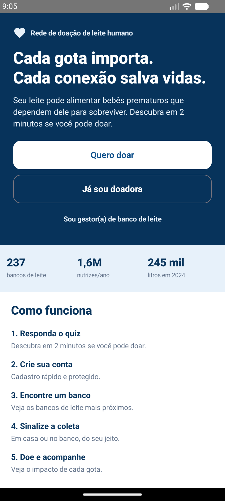 | 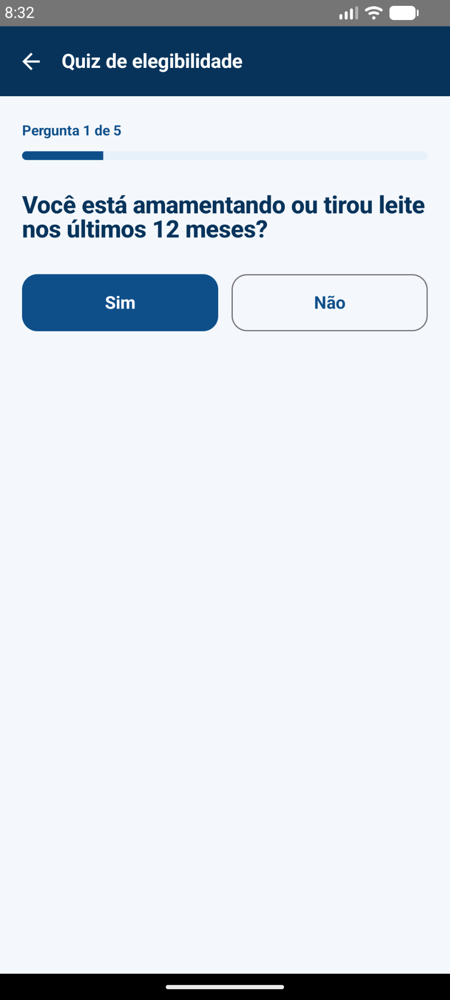 | 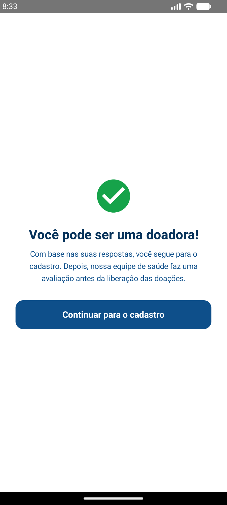 |

| Cadastro (1) | Cadastro (2) | Cadastro (3) |
|---|---|---|
| 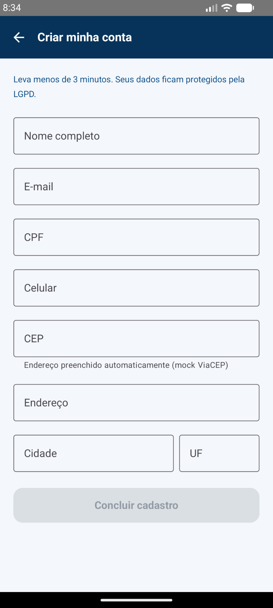 | 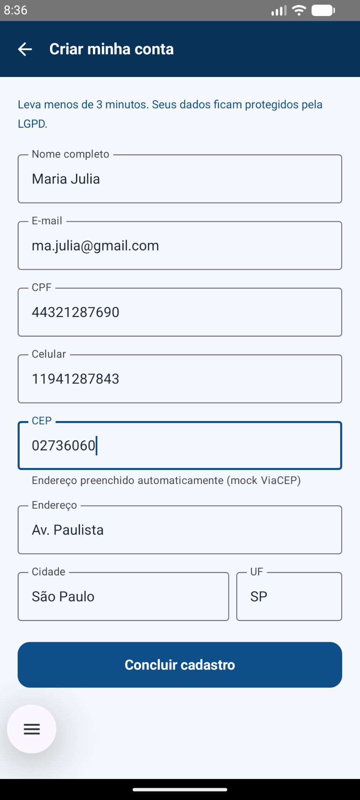 | 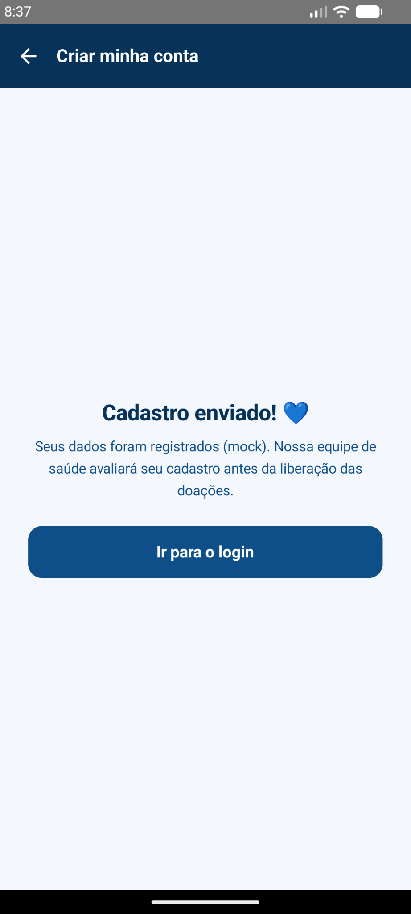 |

| Login |
|---|
| 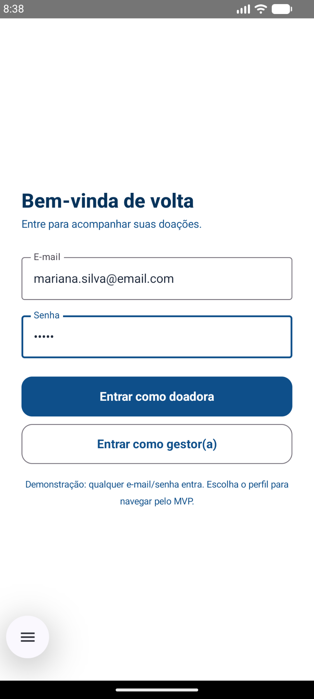 |

### Área da doadora

| Início | Minhas coletas | Sinalizar coleta |
|---|---|---|
| 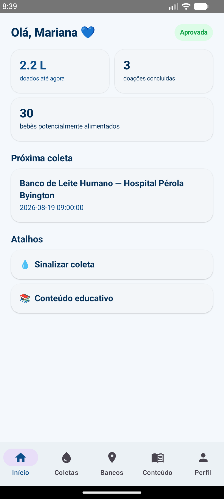 | 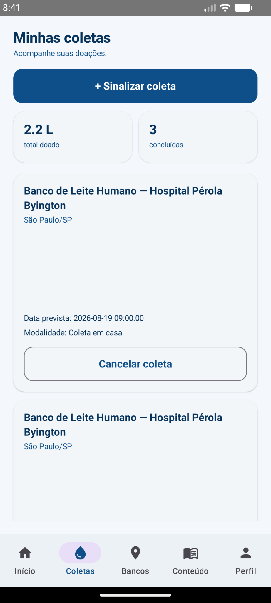 | 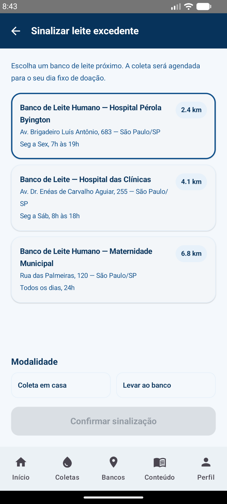 |

| Bancos de leite | Conteúdo educativo | Perfil |
|---|---|---|
| 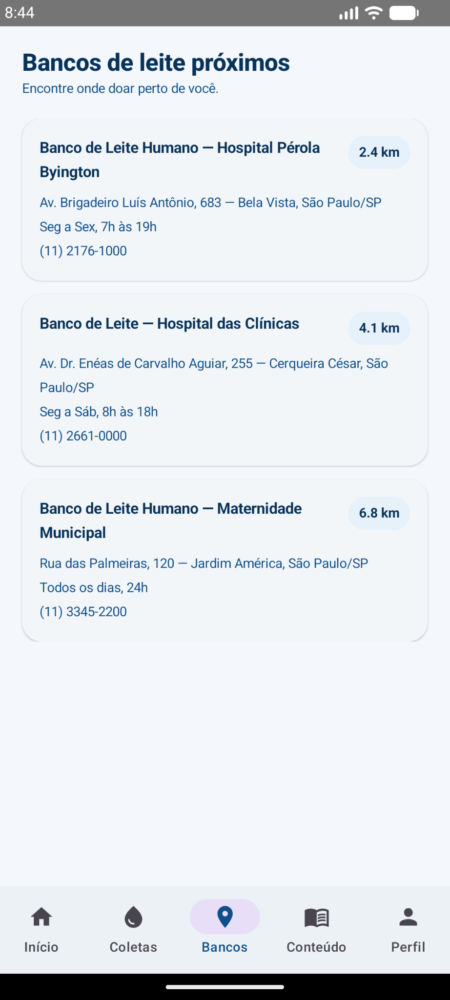 | 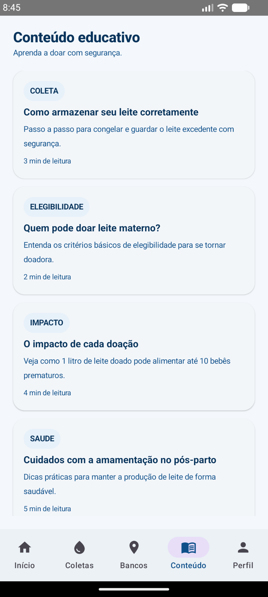 | 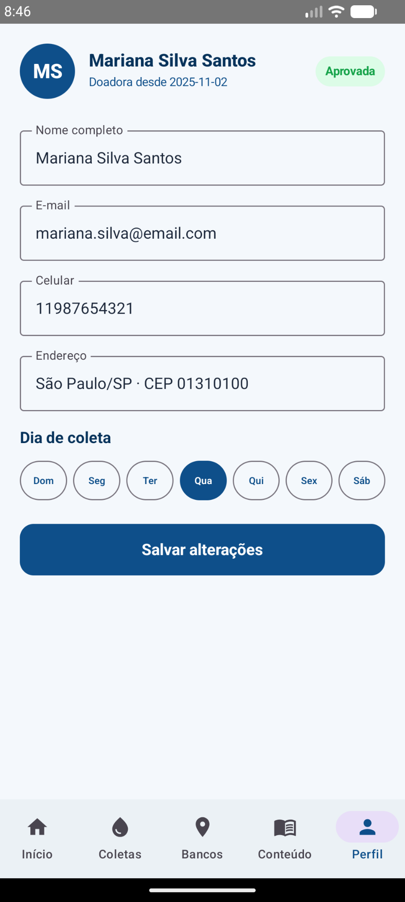 |

### Área do gestor

| Visão geral | Fila de avaliação | Doadoras |
|---|---|---|
| 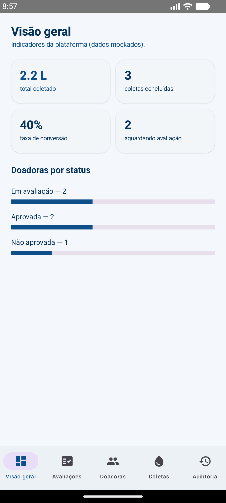 | 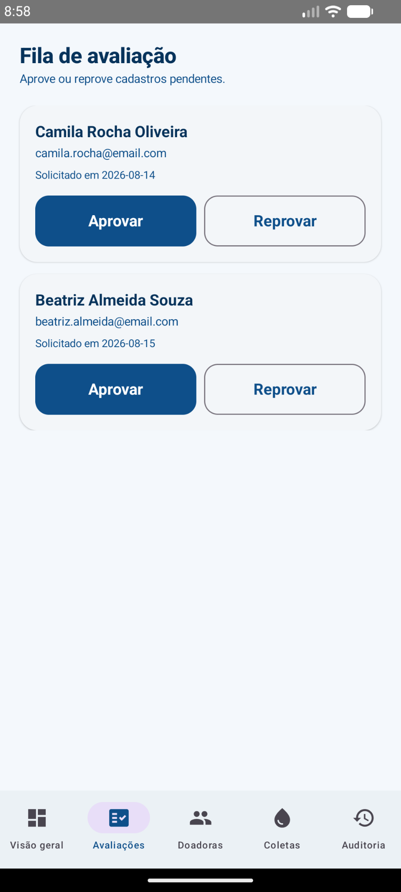 | 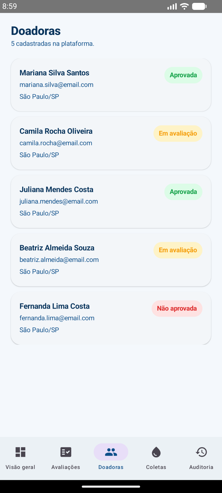 |

| Coletas | Auditoria |
|---|---|
| 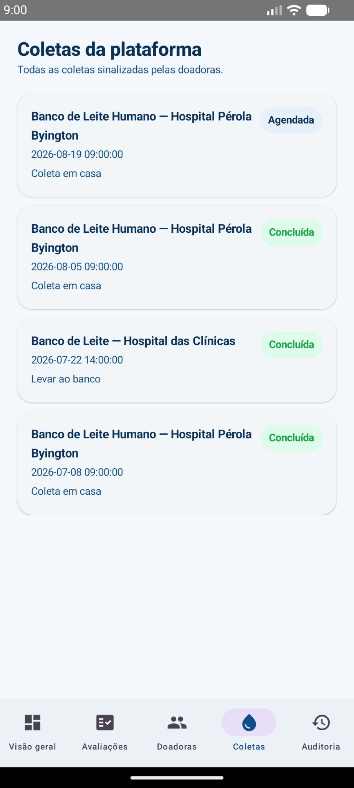 | 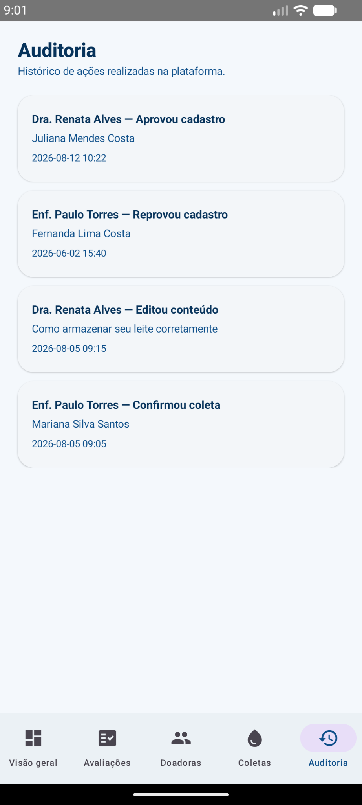 |


## Funcionalidades implementadas

- Onboarding público com quiz de elegibilidade (respostas sim/não) e resultado condicional
  (elegível → cadastro / não elegível → volta ao início).
- Cadastro de doadora com formulário completo e preenchimento automático de endereço a partir do CEP (mockado).
- Login mockado com escolha de perfil (doadora ou gestor), demonstrando as duas áreas do app —
  acessível pelos botões "Já sou doadora" e "Sou gestor(a) de banco de leite" na tela inicial.
- Navegação por abas (bottom navigation) dentro de cada área, com 5 telas na área da doadora e
  5 na área do gestor.
- Listagem dinâmica de coletas, bancos de leite, conteúdos educativos, doadoras e logs de
  auditoria, todas usando `LazyColumn` sobre listas mockadas.
- Navegação para detalhe com passagem de parâmetro: ao tocar em um conteúdo educativo na lista,
  o `slug` do artigo é passado via rota da Navigation Compose (`doadora_conteudo_detalhe/{slug}`)
  para abrir a tela de leitura correspondente.
- Fluxo de sinalização de nova coleta: seleção de banco de leite → seleção de modalidade →
  confirmação, com o novo item aparecendo na lista de coletas (estado em memória).
- Cancelamento de coleta com confirmação em duas etapas e atualização visual imediata do status (badge).
- Fila de avaliação do gestor: aprovar/reprovar atualiza o status da doadora (badge) e remove o
  item da fila, com retorno visual imediato.
- Edição de perfil da doadora (dados pessoais e dia fixo de coleta) com confirmação de "salvo com sucesso".
- Indicadores agregados no painel do gestor (litros coletados, taxa de conversão, doadoras por status).

## Dados mockados utilizados

Toda a simulação de dados fica centralizada em `data/mock/MockData.kt` (nenhum dado é escrito
diretamente dentro das telas). Os modelos usados são definidos em `data/model/Models.kt`:

| Modelo | Representa | Exemplos incluídos |
|---|---|---|
| `Doadora` | Cadastro de uma doadora (dados pessoais, endereço, status de avaliação, dia de coleta) | 5 doadoras com nomes, e-mails, CPFs, endereços e status (`APROVADA`, `PENDENTE`, `REPROVADA`) realistas |
| `BancoLeite` | Banco de leite humano parceiro | 3 bancos com nome, endereço, telefone, horário de funcionamento e distância |
| `Coleta` | Doação sinalizada por uma doadora | 4 coletas com datas, modalidade (domiciliar/presencial), status e volume em ml |
| `Conteudo` | Artigo educativo exibido às doadoras | 4 artigos com título, categoria, tempo de leitura e corpo de texto completo |
| `ItemAvaliacao` | Item da fila de avaliação do gestor | 2 cadastros pendentes de aprovação |
| `LogAuditoria` | Registro de ações administrativas | 4 logs com autor, ação, alvo e data/hora |

Os dados foram escritos com contexto real do domínio (nomes completos, endereços de São Paulo,
CPFs e telefones no formato brasileiro, nomes reais de bancos de leite como o Hospital Pérola
Byington e o Hospital das Clínicas, textos educativos coerentes com o tema de doação de leite
humano) — nenhum dado genérico do tipo "Item 1" ou "Lorem ipsum" foi usado.

## Tecnologias e dependências utilizadas

- **Kotlin** 1.9.24
- **Jetpack Compose** (BOM 2024.06.00) + **Material 3** — UI 100% declarativa, sem XML de layout.
- **Navigation Compose** 2.7.7 — navegação entre telas, passagem de parâmetros via rota e dois
  grafos internos com bottom navigation (área da doadora e área do gestor).
- **Lifecycle ViewModel Compose** 2.8.4 e **Lifecycle Runtime KTX** 2.8.4 — gerenciamento de estado
  e ciclo de vida.
- **Activity Compose** 1.9.1 e **Core KTX** 1.13.1.
- **Material Icons Extended** — ícones do Material Design.
- Estado gerenciado com `remember`, `mutableStateOf` e `mutableStateListOf` do Compose (sem
  biblioteca externa de estado).
- **Android Gradle Plugin** 8.5.2, **Gradle** 8.7, **compileSdk/targetSdk** 34, **minSdk** 24, **JDK** 17.
- **Android Studio**: recomendado Koala (2024.1) ou mais recente — testado com Android Studio na
  versão instalada por cada integrante da equipe (ver observação abaixo).
- Dados mockados em memória (`data/mock/MockData.kt`), sem nenhuma dependência de API, Firebase
  ou banco de dados local, conforme escopo da sprint.
- Paleta de cores e identidade visual alinhadas ao frontend web do projeto (`#0E4F8A` / `#07335B` / `#E7F1FA`).
- Versionamento com Git/GitHub, histórico de commits no repositório indicado acima.

```
app/src/main/java/com/syncare/conectalactare/
├── MainActivity.kt
├── data/
│   ├── model/        ← modelos (Doadora, Coleta, BancoLeite, Conteudo, etc.)
│   └── mock/          ← fonte única de dados mockados usada por todas as telas
├── navigation/         ← rotas, grafo raiz e grafos internos (doadora / gestor)
└── ui/
    ├── theme/          ← cores, tipografia e tema Material 3
    ├── components/     ← componentes reutilizáveis (badges, botões, cards, top bar)
    └── screens/         ← telas organizadas por fluxo (landing, quiz, cadastro, login, doadora, gestor)
```

## Como executar o projeto

**Pré-requisitos:** Android Studio (Koala ou mais recente) com Android SDK 34 instalado e JDK 17.

1. Abra o Android Studio e escolha **Open** → selecione a pasta `ConectaLactare` (a pasta que
   contém o arquivo `settings.gradle.kts`).
2. Aguarde o Gradle sincronizar automaticamente as dependências (é necessário acesso à internet
   na primeira sincronização, para baixar o Gradle e as bibliotecas do Google Maven/Maven Central).
   O Android Studio gerencia o Gradle internamente nessa primeira abertura, então não é preciso
   rodar nada pela linha de comando.
3. Selecione um emulador Android (API 24+) ou conecte um aparelho físico com depuração USB ativada.
4. Clique em **Run ▶** (ou `Shift+F10`) para instalar e abrir o app.
5. Na tela inicial, toque em **"Quero doar"** para seguir o fluxo público (quiz → cadastro →
   login), ou em **"Já sou doadora"** para ir direto ao login e escolher entrar como **doadora**
   ou **gestor(a)** e explorar as respectivas áreas do app.

Não é necessária nenhuma configuração de API, chave ou variável de ambiente — todos os dados
exibidos são mockados localmente no próprio app.

> **Sobre o `gradlew`:** os scripts `gradlew`/`gradlew.bat` estão incluídos, mas o binário
> `gradle/wrapper/gradle-wrapper.jar` não foi versionado neste pacote. Para compilar pela
> linha de comando (fora do Android Studio), rode `gradle wrapper` uma vez com um Gradle
> instalado localmente para gerar esse arquivo — ou simplesmente abra o projeto direto no
> Android Studio, que não depende dele.
